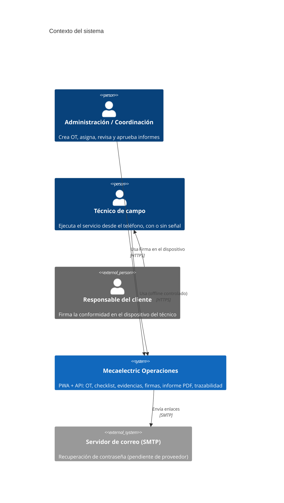
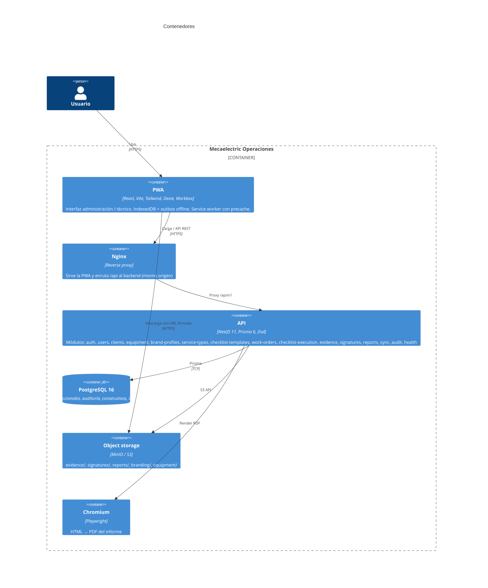
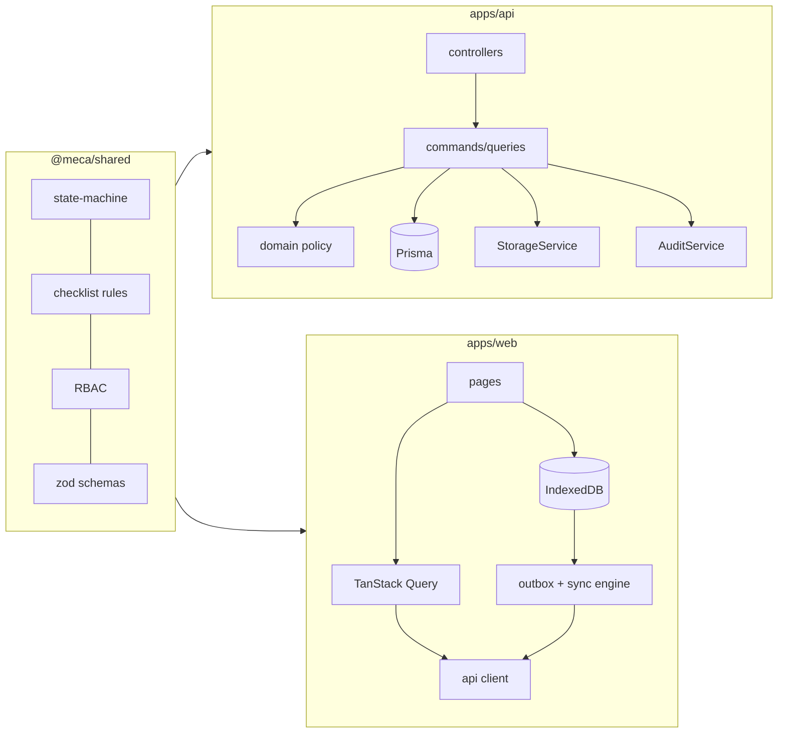

# Arquitectura — Mecaelectric Operaciones

Monolito modular (ADR-001) con una PWA React para dos experiencias: administración
(escritorio) y técnico (móvil, local-first). La API NestJS es la única fuente de
verdad; PostgreSQL guarda datos estructurados y el object storage guarda binarios
(fotos, firmas, PDF, logos).

## C4 — Contexto

## C4 — Contenedores (simplificado)

## Backend: módulos y capas

Cada módulo separa (sin abstracciones innecesarias):

| Capa | Contenido | Ejemplo |
|------|-----------|---------|
| `domain/` | Reglas puras sin I/O | `work-order.policy.ts`, `strokes.ts`, `report-data.ts` |
| `application/` | Casos de uso (comandos / consultas), transacciones, auditoría | `work-order-lifecycle.commands.ts`, `work-order.queries.ts` |
| `infrastructure/` | Persistencia específica, integraciones | `counter.repository.ts`, `pdf-renderer.ts`, `report-template.ts` |
| `presentation/` | Controladores delgados: validación Zod, OpenAPI, permisos | `work-orders.controller.ts` |

Reglas transversales en `@meca/shared` (usadas por API **y** PWA):
máquina de estados (`state-machine.ts`), RBAC (`permissions.ts`), reglas de
finalización RB-006..RB-010 (`checklist.ts`), numeración, esquemas Zod y DTOs.

### Dependencias entre módulos

`WorkOrderCoreModule` concentra acceso, transiciones, consecutivos y mapeos sin
depender de otros módulos de negocio. Evidencias, firmas, checklist e informes lo
importan; `WorkOrdersModule` importa `ReportsModule` (la aprobación genera el PDF);
`SyncModule` orquesta comandos existentes. No hay dependencias circulares.

### Decisiones clave

- **Transiciones**: único punto (`WorkOrderTransitionsService.apply`) que cambia
  `status`, con `UPDATE … WHERE status = actual` como guardia de concurrencia,
  historial y auditoría en la misma transacción. Las OT se bloquean con
  `SELECT … FOR UPDATE` en cada comando.
- **Aprobación + PDF** en una transacción: si el PDF falla, la OT no cambia.
- **Formato de error común** `{ code, message, details, requestId }`; nunca se
  exponen mensajes de Prisma/PostgreSQL ni stack traces.
- **Observabilidad**: Pino JSON, `X-Request-Id` por request (propagado o generado),
  log con requestId, userId, método, ruta, estado y duración; credenciales y
  cookies redactadas. `/api/v1/health` (liveness) y `/api/v1/health/ready`
  (base de datos + storage).

## Frontend

- `ui/`: design system propio (Button, Input, Select, DataTable, StatusBadge,
  Panel, Modal, Drawer, Toast, Timeline, SignaturePad, EvidenceUploader,
  ChecklistField, WorkOrderCard, SyncIndicator…) sobre tokens CSS (`styles/tokens.css`).
- `layouts/`: `AdminLayout` (sidebar) y `MobileLayout` (barra inferior de 4 opciones).
- `features/`: una carpeta por módulo; carga diferida por ruta.
- `lib/offline/`: base Dexie, outbox, acciones locales, motor de sincronización,
  compresión de imágenes. Ver [offline-sync.md](./offline-sync.md).

## Extensión futura

La separación por módulos permite agregar (sin reescribir el núcleo) cotizaciones,
facturación/Siigo (consumiendo `WORK_ORDER_APPROVED`), portal de clientes (nuevo
frontend sobre la misma API y `ClientRef`), mantenimiento preventivo programado
(generador de OT sobre `ChecklistTemplate` + `Equipment`), códigos QR de equipos
(`Equipment.id`) y notificaciones (suscriptores de `AuditLog`).
