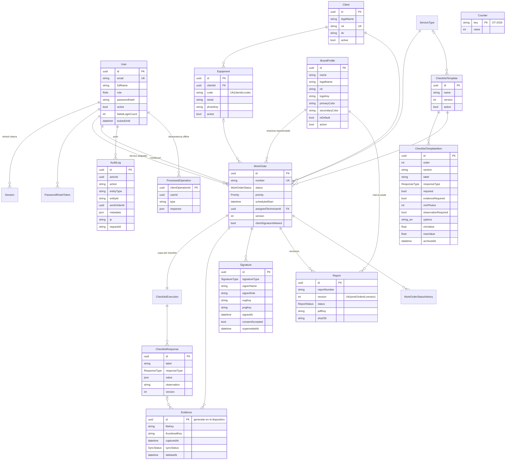

# Modelo de datos (ERD)

Fuente de verdad: [`apps/api/prisma/schema.prisma`](../apps/api/prisma/schema.prisma)
y sus migraciones. IDs internos UUID; números legibles `OT-AAAA-NNNNNN` e
`INF-AAAA-NNNNNN` para humanos.

## Índices (§54)

| Tabla | Índice |
|-------|--------|
| WorkOrder | `number` (único), `status`, `assignedTechnicianId`, `clientId`, `equipmentId`, `scheduledStart`, `createdAt` |
| Equipment | `clientId`, `serial`, único `(clientId, code)` |
| AuditLog | `entityId`, `(workOrderId, createdAt)`, `createdAt`, `actorId` |
| ChecklistResponse | `(executionId, order)` |
| Evidence | `workOrderId`, `checklistResponseId` |

## Borrado

No hay hard delete de OT, informes, evidencias, firmas ni auditoría (RB-016):

- Evidencias: `deletedAt` / `deletedById` (retiro lógico).
- Firmas: una nueva firma del mismo tipo marca la anterior con `supersededAt`.
- Informes: nuevas versiones marcan las anteriores `SUPERSEDED`.
- Configuración (clientes, equipos, marcas, tipos, plantillas, usuarios): `active`.
- Ítems de plantilla retirados: `archivedAt` (las OT conservan su copia).
