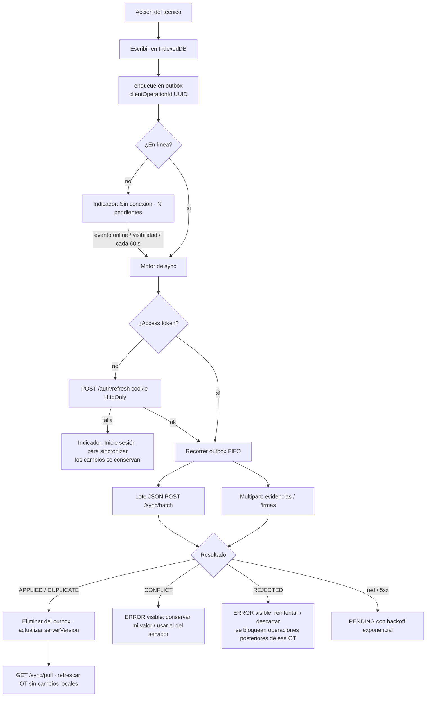

# Operación offline y sincronización

Requisito crítico (§24–25, §60): el técnico debe poder continuar un servicio sin
conectividad y sincronizar después sin pérdidas ni duplicados.

## Qué se guarda en el dispositivo (IndexedDB · Dexie)

| Tabla | Contenido |
|-------|-----------|
| `workOrders` | OT activas descargadas (detalle + historial de estados). `status` refleja el cambio local optimista |
| `responses` | respuestas del checklist con `serverVersion` (base de la concurrencia optimista) y `dirty` |
| `evidence` | fotos comprimidas (`blob`, `thumbBlob`) pendientes, y thumbnails descargados de las ya sincronizadas |
| `signatures` | PNG + trazos vectoriales de firmas pendientes |
| `outbox` | operaciones pendientes: `id` (= clientOperationId), `operationType`, `entityType`, `entityId`, `payload`, `createdAt`, `retryCount`, `status` (PENDING/SYNCING/SYNCED/ERROR), `lastError`, `errorCode`, `errorData` |
| `meta` | último usuario autenticado (sin tokens), última descarga |

El service worker (Workbox, `generateSW`) precachea la aplicación completa
(todos los chunks, fuentes e iconos), por lo que la PWA abre sin conexión.
La API **no** se cachea en el service worker: los datos viven en IndexedDB.

## Flujo

### Orden e integridad

- FIFO estricto por `createdAt`. Operaciones JSON contiguas se agrupan (máx. 50);
  las subidas binarias se envían entre ellas respetando el orden (p. ej. `START`
  antes que las fotos, fotos antes que `SUBMIT`).
- Si una operación de una OT falla, las siguientes de esa OT esperan (no se
  envía un `SUBMIT` después de una foto rechazada).
- Ediciones sucesivas de la misma respuesta (o de las conclusiones) aún no
  enviadas se **fusionan**, conservando la `baseVersion` original.
- Eliminar una foto que nunca llegó al servidor descarta su subida; si ya subió,
  se encola `EVIDENCE_DELETE` (retiro lógico en el servidor).

## Idempotencia en el servidor

| Tipo | Clave |
|------|-------|
| Operaciones JSON (`/sync/batch`) | `ProcessedOperation.clientOperationId`: repetir devuelve `DUPLICATE` con la respuesta original |
| Transición ya aplicada con otro id (respuesta perdida) | si el estado actual ya es el destino → `DUPLICATE` |
| Evidencias y firmas | `id` UUID generado en el dispositivo = clave primaria; repetir devuelve el registro existente |
| Respuesta de checklist idéntica | no incrementa versión ni audita |

La prueba E2E `offline.spec.ts` verifica: un solo `WORK_ORDER_ACCEPTED`,
`WORK_ORDER_STARTED`, `WORK_ORDER_SUBMITTED`, `EVIDENCE_ADDED` y dos
`SIGNATURE_ADDED` tras trabajar offline, recargar sin señal y sincronizar.
La prueba de integración `sync.e2e-spec.ts` reenvía lotes completos.

## Concurrencia optimista y conflictos

- `ChecklistResponse.version` y `WorkOrder.version`.
- Una respuesta cuya `baseVersion` no coincide produce `409 VERSION_CONFLICT`
  — "Esta orden fue modificada desde otro dispositivo." — con el valor del servidor
  en `details.server`. La pantalla **Actividad** muestra ambos valores y permite
  *Conservar mi valor* (`force: true`) o *Usar valor del servidor*. Nunca se
  sobrescribe en silencio.
- Las transiciones de estado se protegen con la máquina de estados y el bloqueo
  de fila, no con `version`.

## Sesión sin conexión

El access token vive solo en memoria. Si la app se abre sin señal se usa el
último perfil guardado (sin tokens) para mostrar las órdenes locales; al volver
la conexión el motor renueva el token con la cookie HttpOnly. Si el refresh
expiró (14 días) los cambios permanecen y se pide iniciar sesión.
Cerrar sesión borra los datos locales; si hay pendientes se advierte antes.

## Imágenes

En el dispositivo: `createImageBitmap(file, { imageOrientation: 'from-image' })`
(corrige EXIF), lado largo ≤ 1920 px, JPEG 0.82, thumbnail 360 px. En el
servidor (sharp): validación del contenido real (JPEG/PNG/WebP), rotación,
eliminación de metadatos, recompresión y thumbnail definitivo.
