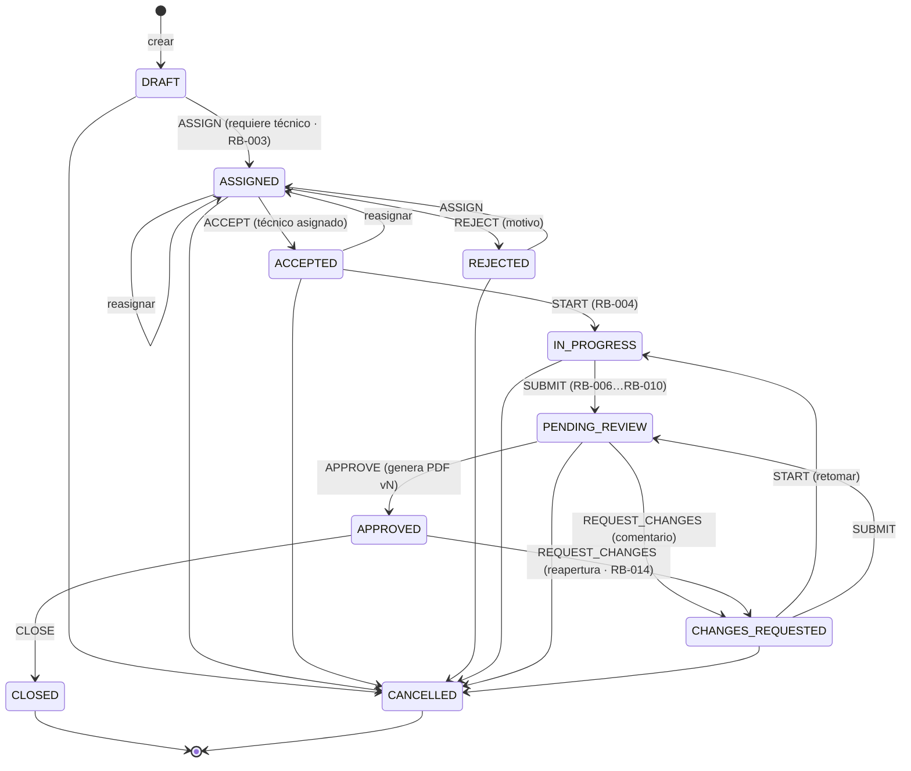
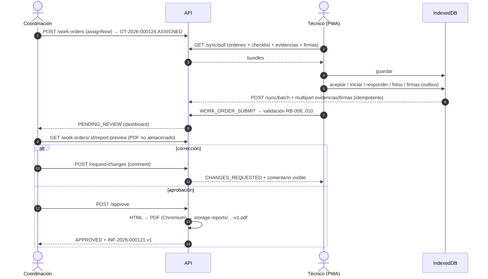

# Flujo de la Orden de Trabajo

## Máquina de estados

Definida una sola vez en [`packages/shared/src/state-machine.ts`](../packages/shared/src/state-machine.ts)
y aplicada por el servidor en `WorkOrderTransitionsService`. La PWA la usa para
mostrar solo las acciones posibles (`availableActions`) y para el estado optimista
offline, pero el backend siempre la vuelve a validar.

| Acción | Desde | Hacia | Permiso | Solo asignado |
|--------|-------|-------|---------|---------------|
| ASSIGN | DRAFT, ASSIGNED, REJECTED, ACCEPTED | ASSIGNED | WORK_ORDERS_ASSIGN | no |
| ACCEPT | ASSIGNED | ACCEPTED | WORK_ORDERS_EXECUTE | sí |
| REJECT | ASSIGNED | REJECTED | WORK_ORDERS_EXECUTE | sí |
| START | ACCEPTED, CHANGES_REQUESTED | IN_PROGRESS | WORK_ORDERS_EXECUTE | sí |
| SUBMIT | IN_PROGRESS, CHANGES_REQUESTED | PENDING_REVIEW | WORK_ORDERS_EXECUTE | sí |
| REQUEST_CHANGES | PENDING_REVIEW, APPROVED | CHANGES_REQUESTED | WORK_ORDERS_REVIEW | no |
| APPROVE | PENDING_REVIEW | APPROVED | WORK_ORDERS_REVIEW | no |
| CLOSE | APPROVED | CLOSED | WORK_ORDERS_MANAGE | no |
| CANCEL | todo estado previo a APPROVED | CANCELLED | WORK_ORDERS_MANAGE | no |

Un intento inválido responde `409 WORK_ORDER_INVALID_STATE`, p. ej.
`"La orden debe estar aceptada antes de iniciar el servicio."`

## Reglas de negocio y dónde se aplican

| Regla | Implementación |
|-------|----------------|
| RB-001 cliente obligatorio | `createWorkOrderSchema` + validación de referencias activas |
| RB-002 equipo si el servicio lo exige | `ServiceType.requiresEquipment` → `422 WORK_ORDER_REQUIRES_EQUIPMENT`; el equipo debe pertenecer al cliente |
| RB-003 técnico antes de ASSIGNED | `ASSIGN` exige técnico activo con rol TÉCNICO |
| RB-004 aceptar antes de iniciar | máquina de estados |
| RB-005 solo el técnico asignado edita | `WorkOrderPolicy.assertCanExecute` (asignado + estado IN_PROGRESS/CHANGES_REQUESTED) |
| RB-006/007/008/009/010 | `evaluateSubmission` (compartido) en el servidor al enviar; `422 WORK_ORDER_INCOMPLETE` con `details.issues` |
| RB-011 datos del firmante | `signatureMetaSchema` (nombre, cargo opcional, fecha/hora, trazos + PNG, consentimiento) |
| RB-012/013 marca del PDF | `WorkOrder.representedCompanyId` → `BrandProfile` en el render |
| RB-014 no modificar aprobado | edición bloqueada en APPROVED/CLOSED/CANCELLED; reapertura o regeneración = nueva versión |
| RB-015 auditoría | `AuditService.record` en la misma transacción de cada acción crítica |
| RB-016 sin hard delete | ver [erd.md](./erd.md#borrado) |

## Secuencia principal

## Consecutivos

`Counter(key='OT-2026')` con `INSERT … ON CONFLICT DO UPDATE … RETURNING` dentro de
la transacción de creación: sin duplicados bajo concurrencia (probado con 6
creaciones simultáneas) y sin consumir números si la transacción falla. El año
se calcula en `America/Bogota`. El informe conserva el mismo `INF-…` entre
versiones.
